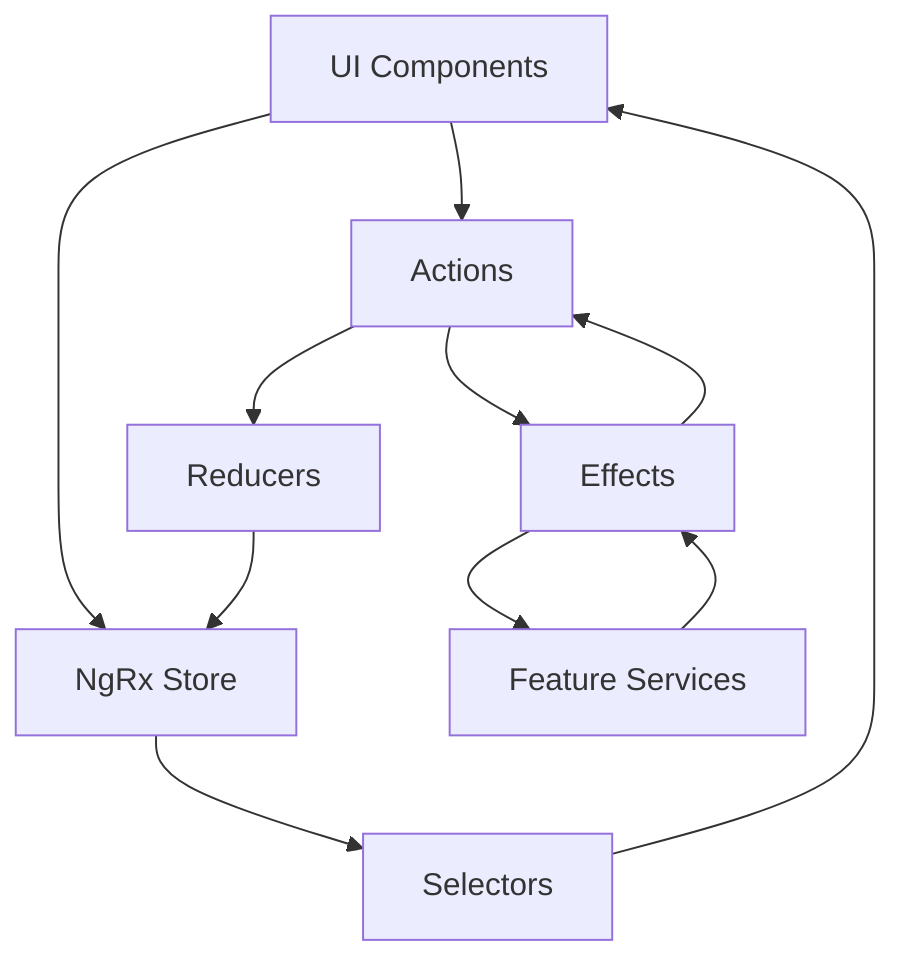
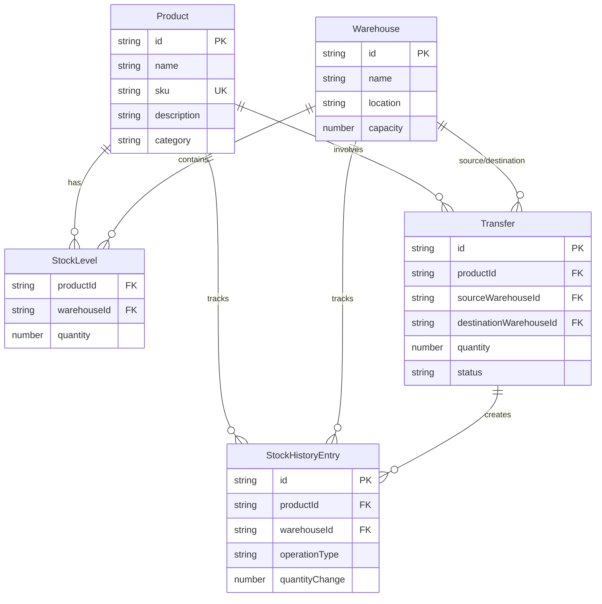

# Design Document: Inventory & Warehouse Management System

## Overview

The Inventory & Warehouse Management System is an Angular application built using standalone components and NgRx for state management. The system follows a feature-based architecture where each domain (products, warehouses, stock, transfers, stock-history) is self-contained with its own components, services, models, and store slice.

The application uses a reactive architecture pattern where UI components dispatch actions to the NgRx store, effects handle side effects and business logic, and selectors provide derived state to components. All components are standalone, eliminating the need for NgModules and enabling tree-shakable, lazy-loaded features.

## Architecture

### High-Level Architecture



### Feature-Based Structure

Each feature module follows this internal structure:
- **components/**: UI components for the feature (list, form, detail views)
- **store/**: NgRx artifacts (actions, reducers, effects, selectors)
- **services/**: Business logic and data access services
- **models/**: TypeScript interfaces and types

### Core Architecture Principles

1. **Standalone Components**: All components use `standalone: true` and import dependencies directly
2. **Feature Isolation**: Each feature is self-contained and can be lazy-loaded independently
3. **Unidirectional Data Flow**: Data flows from store → selectors → components → actions → reducers → store
4. **Immutable State**: All state updates create new objects rather than mutating existing state
5. **Reactive Programming**: RxJS observables for asynchronous operations and state subscriptions

## Components and Interfaces

### Products Feature

#### Components

**ProductListComponent**
- Displays all products in a table or grid
- Subscribes to `selectAllProducts` selector
- Dispatches `loadProducts` action on initialization
- Provides navigation to product detail and form views

**ProductFormComponent**
- Handles create and edit operations
- Uses reactive forms with validation
- Dispatches `createProduct` or `updateProduct` actions on submit
- Navigates back to list on success

**ProductDetailComponent**
- Displays detailed product information
- Shows stock levels across all warehouses for the product
- Subscribes to `selectProductById` selector
- Provides edit and delete actions

#### Store

**Actions**
```typescript
loadProducts()
loadProductsSuccess(products: Product[])
loadProductsFailure(error: any)
createProduct(product: Product)
createProductSuccess(product: Product)
updateProduct(product: Product)
updateProductSuccess(product: Product)
deleteProduct(id: string)
deleteProductSuccess(id: string)
```

**State Shape**
```typescript
{
  products: {
    entities: { [id: string]: Product },
    ids: string[],
    selectedProductId: string | null,
    loading: boolean,
    error: any
  }
}
```

**Selectors**
- `selectAllProducts`: Returns array of all products
- `selectProductById(id)`: Returns specific product
- `selectProductsLoading`: Returns loading state
- `selectProductsError`: Returns error state

#### Service

**ProductService**
- `getAll()`: Retrieves all products
- `getById(id)`: Retrieves single product
- `create(product)`: Creates new product
- `update(product)`: Updates existing product
- `delete(id)`: Deletes product

#### Model

```typescript
interface Product {
  id: string;
  name: string;
  sku: string;
  description: string;
  category: string;
  createdAt: Date;
  updatedAt: Date;
}
```

### Warehouses Feature

#### Components

**WarehouseListComponent**
- Displays all warehouses with summary information
- Shows total stock count per warehouse
- Provides navigation to warehouse details

**WarehouseFormComponent**
- Handles warehouse creation and editing
- Validates capacity as positive number
- Includes location information fields

**WarehouseDetailComponent**
- Shows warehouse information and current stock levels
- Displays products stored in the warehouse
- Provides quick access to stock adjustments

#### Store

**State Shape**
```typescript
{
  warehouses: {
    entities: { [id: string]: Warehouse },
    ids: string[],
    selectedWarehouseId: string | null,
    loading: boolean,
    error: any
  }
}
```

#### Model

```typescript
interface Warehouse {
  id: string;
  name: string;
  location: string;
  capacity: number;
  createdAt: Date;
  updatedAt: Date;
}
```

### Stock Feature

#### Components

**StockListComponent**
- Displays stock levels in a matrix view (products × warehouses)
- Provides filtering by product or warehouse
- Shows low stock warnings
- Enables quick stock adjustments

**StockAdjustmentComponent**
- Handles stock increase/decrease operations
- Validates quantity inputs
- Requires reason for adjustment
- Creates stock history entry

#### Store

**State Shape**
```typescript
{
  stock: {
    entities: { [key: string]: StockLevel },  // key: `${productId}_${warehouseId}`
    loading: boolean,
    error: any
  }
}
```

**Key Selectors**
- `selectStockByProductAndWarehouse(productId, warehouseId)`
- `selectStockByProduct(productId)`: All warehouses for a product
- `selectStockByWarehouse(warehouseId)`: All products in a warehouse
- `selectLowStockItems(threshold)`: Items below threshold

#### Model

```typescript
interface StockLevel {
  productId: string;
  warehouseId: string;
  quantity: number;
  lastUpdated: Date;
}
```

### Transfers Feature

#### Components

**TransferListComponent**
- Displays all transfers with status
- Filters by date range, product, or warehouse
- Shows pending, completed, and cancelled transfers

**TransferFormComponent**
- Creates new transfer requests
- Validates source warehouse has sufficient stock
- Prevents transfers to same warehouse
- Calculates estimated completion time

**TransferDetailComponent**
- Shows transfer details and status
- Displays source and destination information
- Provides cancel option for pending transfers

#### Store

**State Shape**
```typescript
{
  transfers: {
    entities: { [id: string]: Transfer },
    ids: string[],
    loading: boolean,
    error: any
  }
}
```

**Effects Logic**
- `createTransfer$`: Validates stock, updates stock levels, creates history entries
- `completeTransfer$`: Updates transfer status and stock levels atomically

#### Model

```typescript
interface Transfer {
  id: string;
  productId: string;
  sourceWarehouseId: string;
  destinationWarehouseId: string;
  quantity: number;
  status: 'pending' | 'completed' | 'cancelled';
  requestedAt: Date;
  completedAt?: Date;
  requestedBy: string;
  notes?: string;
}
```

### Stock History Feature

#### Components

**StockHistoryListComponent**
- Displays chronological history of stock changes
- Provides filtering by product, warehouse, operation type, date range
- Exports history to CSV
- Shows visual timeline of changes

**StockHistoryDetailComponent**
- Shows detailed information about a specific history entry
- Links to related product and warehouse
- For transfers, shows both source and destination entries

#### Store

**State Shape**
```typescript
{
  stockHistory: {
    entities: { [id: string]: StockHistoryEntry },
    ids: string[],
    filters: {
      productId?: string,
      warehouseId?: string,
      operationType?: string,
      startDate?: Date,
      endDate?: Date
    },
    loading: boolean,
    error: any
  }
}
```

#### Model

```typescript
interface StockHistoryEntry {
  id: string;
  productId: string;
  warehouseId: string;
  operationType: 'sales' | 'removal' | 'transfer_out' | 'transfer_in' | 'adjustment';
  quantityChange: number;
  previousQuantity: number;
  newQuantity: number;
  timestamp: Date;
  performedBy: string;
  reason?: string;
  relatedTransferId?: string;
  relatedWarehouseId?: string;  // For transfers, the other warehouse
}
```

## Data Models

### Entity Relationships



### State Normalization

All entities are stored in normalized form using the entity adapter pattern:
- `entities`: Object map with entity ID as key
- `ids`: Array of entity IDs for ordering
- This prevents data duplication and ensures consistency

## Error Handling

### Error Categories

1. **Validation Errors**: Client-side form validation failures
2. **Business Logic Errors**: Insufficient stock, invalid transfers
3. **Service Errors**: API failures, network issues
4. **State Errors**: Concurrent modification conflicts

### Error Handling Strategy

**Component Level**
- Display user-friendly error messages
- Provide retry mechanisms for transient failures
- Disable submit buttons during processing

**Effects Level**
- Catch errors from service calls
- Dispatch failure actions with error payload
- Log errors for debugging

**Reducer Level**
- Store error state for component access
- Clear errors on new operations
- Maintain previous valid state on errors

**Service Level**
- Return typed error objects
- Include error codes for categorization
- Provide detailed error messages

### Example Error Flow

```typescript
// Effect
createProduct$ = createEffect(() =>
  this.actions$.pipe(
    ofType(ProductActions.createProduct),
    exhaustMap(action =>
      this.productService.create(action.product).pipe(
        map(product => ProductActions.createProductSuccess({ product })),
        catchError(error => of(ProductActions.createProductFailure({ error })))
      )
    )
  )
);

// Component
this.error$ = this.store.select(selectProductsError);
```

## Testing Strategy

### Unit Testing

**Components**
- Test component logic in isolation
- Mock store selectors and actions
- Verify correct action dispatching
- Test form validation logic
- Use Angular Testing Library for user-centric tests

**Reducers**
- Test state transitions for each action
- Verify immutability
- Test edge cases (empty state, invalid data)
- Ensure idempotency where applicable

**Selectors**
- Test selector output for various state shapes
- Verify memoization behavior
- Test composed selectors

**Services**
- Mock HTTP calls
- Test error handling
- Verify request/response transformations

**Effects**
- Test action dispatching based on service responses
- Verify error handling paths
- Test action sequencing for complex flows

### Integration Testing

**Feature Flows**
- Test complete user journeys (create product → add stock → transfer)
- Verify state consistency across features
- Test navigation and routing
- Validate cross-feature interactions

**Store Integration**
- Test multiple features interacting through shared state
- Verify effect chains work correctly
- Test optimistic updates and rollbacks

### E2E Testing

**Critical Paths**
- Product creation and management
- Stock adjustment workflows
- Transfer between warehouses
- History tracking accuracy

**User Scenarios**
- New warehouse manager onboarding flow
- Daily stock management tasks
- Month-end inventory audit

### Testing Tools

- **Jasmine/Jest**: Unit test framework
- **Angular Testing Library**: Component testing
- **@ngrx/store/testing**: Store testing utilities
- **Cypress/Playwright**: E2E testing
- **MSW (Mock Service Worker)**: API mocking

### Test Coverage Goals

- Components: 80% coverage
- Reducers: 100% coverage
- Selectors: 100% coverage
- Effects: 90% coverage
- Services: 85% coverage

## Routing and Lazy Loading

### Route Structure

```typescript
// app.routes.ts
export const routes: Routes = [
  { path: '', redirectTo: '/products', pathMatch: 'full' },
  {
    path: 'products',
    loadComponent: () => import('./features/products/components/product-list.component'),
    children: [
      { path: 'new', loadComponent: () => import('./features/products/components/product-form.component') },
      { path: ':id', loadComponent: () => import('./features/products/components/product-detail.component') },
      { path: ':id/edit', loadComponent: () => import('./features/products/components/product-form.component') }
    ]
  },
  {
    path: 'warehouses',
    loadComponent: () => import('./features/warehouses/components/warehouse-list.component'),
    children: [
      { path: 'new', loadComponent: () => import('./features/warehouses/components/warehouse-form.component') },
      { path: ':id', loadComponent: () => import('./features/warehouses/components/warehouse-detail.component') }
    ]
  },
  {
    path: 'stock',
    loadComponent: () => import('./features/stock/components/stock-list.component')
  },
  {
    path: 'transfers',
    loadComponent: () => import('./features/transfers/components/transfer-list.component'),
    children: [
      { path: 'new', loadComponent: () => import('./features/transfers/components/transfer-form.component') },
      { path: ':id', loadComponent: () => import('./features/transfers/components/transfer-detail.component') }
    ]
  },
  {
    path: 'history',
    loadComponent: () => import('./features/stock-history/components/stock-history-list.component')
  }
];
```

### Store Configuration

```typescript
// main.ts
bootstrapApplication(AppComponent, {
  providers: [
    provideRouter(routes),
    provideStore({
      products: productsReducer,
      warehouses: warehousesReducer,
      stock: stockReducer,
      transfers: transfersReducer,
      stockHistory: stockHistoryReducer
    }),
    provideEffects([
      ProductsEffects,
      WarehousesEffects,
      StockEffects,
      TransfersEffects,
      StockHistoryEffects
    ]),
    provideStoreDevtools({ maxAge: 25 })
  ]
});
```

## Performance Considerations

### Optimization Strategies

1. **OnPush Change Detection**: All components use `ChangeDetectionStrategy.OnPush`
2. **Virtual Scrolling**: Large lists use CDK virtual scrolling
3. **Memoized Selectors**: All selectors use `createSelector` for memoization
4. **Lazy Loading**: Features loaded on-demand
5. **TrackBy Functions**: All `*ngFor` directives use trackBy
6. **Debounced Search**: Search inputs debounced to reduce selector calls

### State Management Performance

- Use entity adapters for normalized state
- Avoid deeply nested state structures
- Keep selectors simple and composable
- Use `distinctUntilChanged` to prevent unnecessary emissions

## Security Considerations

### Authentication & Authorization

- Auth guard protects all routes
- JWT tokens stored securely
- Role-based access control for sensitive operations
- Session timeout handling

### Data Validation

- Client-side validation for user experience
- Server-side validation as source of truth
- Sanitize user inputs
- Validate business rules (stock levels, transfer validity)

### Audit Trail

- Stock history provides complete audit trail
- User attribution for all operations
- Timestamp all state changes
- Immutable history records

## Deployment and Build

### Build Configuration

```typescript
// environment.ts
export const environment = {
  production: false,
  apiUrl: 'http://localhost:3000/api'
};

// environment.prod.ts
export const environment = {
  production: true,
  apiUrl: 'https://api.inventory.example.com'
};
```

### Build Optimization

- Ahead-of-Time (AOT) compilation
- Tree shaking for unused code removal
- Code splitting by feature
- Asset optimization and compression
- Service worker for offline capability (optional)

## Future Enhancements

1. **Real-time Updates**: WebSocket integration for live stock updates
2. **Barcode Scanning**: Mobile barcode scanning for stock operations
3. **Reporting Dashboard**: Analytics and visualization of inventory trends
4. **Multi-tenancy**: Support for multiple organizations
5. **Advanced Forecasting**: ML-based stock level predictions
6. **Mobile App**: Native mobile application using Ionic or similar
7. **Batch Operations**: Bulk import/export of products and stock levels
8. **Notifications**: Email/SMS alerts for low stock or pending transfers
